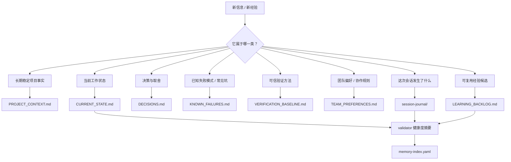
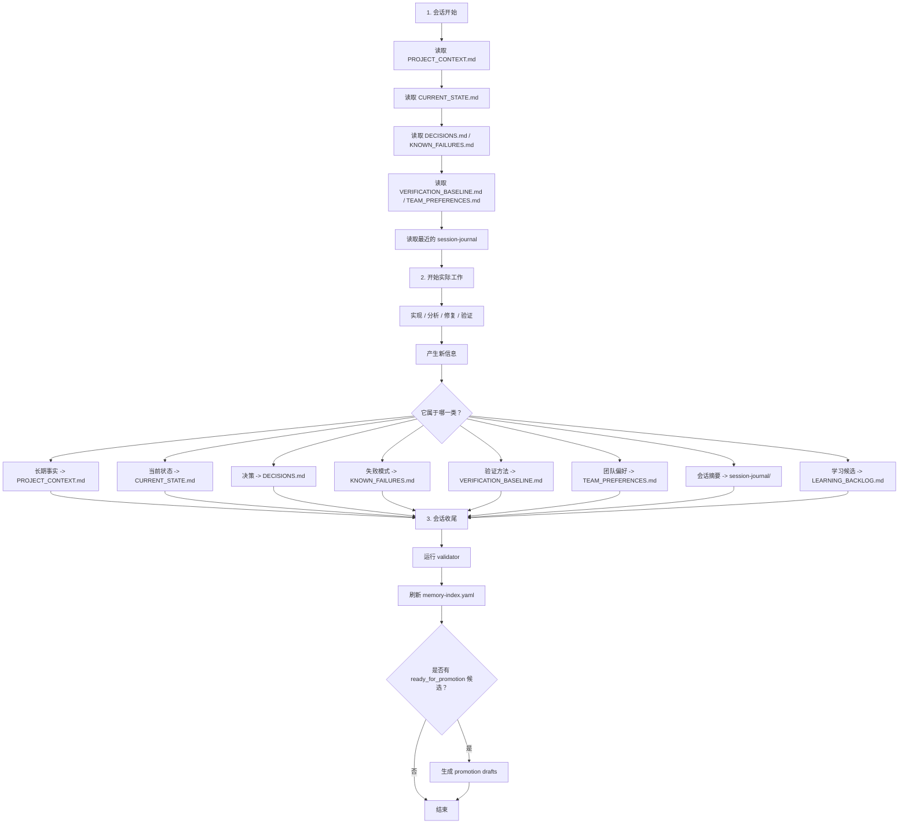
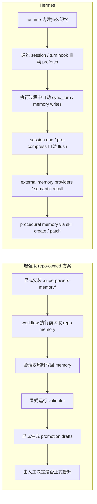

# 记忆与自学习学习笔记

这份文档整理了一组关于增强版记忆模型的讨论，起点是“这些记忆文件之间的分工关系图”，用于作为技能库学习材料保存。

它覆盖三个主题：

1. 记忆文件之间的职责分工
2. 一次真实开发会话里的常见读取、更新与校验流程
3. 增强版 repo-owned 方案与 Hermes runtime memory / self-learning 的对照

---

## 1. 记忆文件之间的职责分工

这一部分回答一个核心问题：

**当出现一条新信息时，它应该写进哪个记忆文件？**



### `PROJECT_CONTEXT.md`

这里保存的是跨会话仍然成立的长期事实。

示例：

- 项目的核心目标
- 主要架构边界
- 长期稳定的模块职责
- 持久的技术约束

不适合写这里的内容：

- 今天正在做什么
- 临时 blocker
- 一次性排障笔记

判断口诀：  
**如果这条信息下周开新会话时仍然大概率成立，它更适合写这里。**

### `CURRENT_STATE.md`

这里保存的是“当前工作现场”。

示例：

- 当前正在推进的任务
- 现在的阻塞点
- 刚刚完成了什么
- 下一步建议做什么

不适合写这里的内容：

- 长期架构规则
- 历史坑位目录
- 团队长期偏好

判断口诀：  
**如果它回答的是“现在是什么状态”，就更适合写这里。**

### `DECISIONS.md`

这里保存重要决策，以及为什么这么做。

示例：

- 为什么选方案 A 而不是方案 B
- 为什么把 validation 变成收尾 gate
- 为什么把某个能力放在某一层
- 为什么某个学习候选暂时只进 backlog，不直接变成 skill

不适合写这里的内容：

- 普通状态更新
- 泛化的会话摘要
- 没有决策理由的事实

判断口诀：  
**如果它回答的是“为什么这样选”，那就更适合写这里。**

### `KNOWN_FAILURES.md`

这里保存重复可复现的坑、失败模式和脆弱点。

示例：

- 脚本在 Windows PowerShell 5.1 下会失败
- 某种命名模式会让 validator 误报
- 缺少某个 runtime 会阻塞 Linux/macOS 的真实验证
- 某个 closeout 步骤很容易被忘记

不适合写这里的内容：

- 没有复用价值的一次性事故
- 还没证明具有重复性的偶发问题

判断口诀：  
**如果这条经验的含义是“下次别再踩”，它就更适合写这里。**

### `VERIFICATION_BASELINE.md`

这里保存团队认可的验证规则和证据标准。

示例：

- 哪个命令才算正式验证入口
- 什么结果算通过
- 什么只算静态检查
- Windows、Linux、macOS 上的验证差异

不适合写这里的内容：

- 普通项目背景
- 当前工作状态
- 协作偏好

判断口诀：  
**如果它回答的是“怎么证明这件事是真的”，就属于这里。**

### `TEAM_PREFERENCES.md`

这里保存团队长期协作偏好、规则和边界。

示例：

- 默认不要自动启用 superpowers
- 必须显式调用 workflow
- 晋升前要人工审核
- 中英文文档要保持对齐

判断口诀：  
**如果它更像“我们通常怎么协作”，就适合写这里。**

### `session-journal/`

这里保存某一次会话里具体发生了什么。

示例：

- 改了什么
- 修了什么
- 跑了什么验证
- 最终结果是什么

判断口诀：  
**如果它回答的是“这次发生了什么”，就写成 journal。**

### `LEARNING_BACKLOG.md`

这里保存尚未晋升的可复用经验候选。

示例：

- 一个反复出现的 checklist 模式
- 某个兼容性经验可能值得变成 rule
- 某个实现套路未来可能值得变成 skill draft

判断口诀：  
**如果问题是“以后要不要把它变成可复用资产”，它就适合写这里。**

### `memory-index.yaml`

这个文件通常由脚本维护，而不是手工写正文。

它汇总：

- 记忆健康度
- 最近复查情况
- warning / error 数量
- backlog 候选数量

判断口诀：  
**它是状态索引，不是主知识文档。**

---

## 2. 一次真实会话里的常见读取、更新与校验流程

这一部分展示一轮真实开发会话里，这些文件通常如何流动。



### 一开始通常先读什么

常见顺序是：

1. `PROJECT_CONTEXT.md`
2. `CURRENT_STATE.md`
3. `DECISIONS.md`
4. `KNOWN_FAILURES.md`
5. `VERIFICATION_BASELINE.md`
6. `TEAM_PREFERENCES.md`
7. 最近的 `session-journal/`

这个顺序合理的原因是：

- 先拿长期背景
- 再拿当前现场
- 再补决策和已知坑
- 再补验证口径和团队边界
- 最后看最近一次执行过程

### 收尾时通常怎么写回

一个实用的写回顺序通常是：

```text
CURRENT_STATE.md
-> session-journal/
-> DECISIONS.md / KNOWN_FAILURES.md / VERIFICATION_BASELINE.md / TEAM_PREFERENCES.md
-> PROJECT_CONTEXT.md（仅当长期事实真的变了）
-> LEARNING_BACKLOG.md
```

原因是：

- `CURRENT_STATE.md` 最快表达 handoff 状态
- journal 先保留本轮过程
- durable memory 需要分类判断
- backlog 往往出现在反思之后

### 为什么 validator 很重要

写完记忆后，常见问题不只是“没写”。

更常见的是：

- 写到了错误的文件
- 漏了元数据
- `CURRENT_STATE.md` 太旧
- journal 太旧
- promotion 候选缺少关键字段

这也是为什么仓库里有：

- [validate-superpowers-memory.ps1](/D:/spring_AI/superpowers-openspec-team-skills/scripts/validate-superpowers-memory.ps1)
- [validate-superpowers-memory.sh](/D:/spring_AI/superpowers-openspec-team-skills/scripts/validate-superpowers-memory.sh)

它本质上就是会话收尾时的 memory QA。

### 什么时候会进入 promotion draft

并不是每次会话都会走到这一步。

只有当 `LEARNING_BACKLOG.md` 里已经有：

- `status: ready_for_promotion`

这样的条目时，才值得继续运行：

- [generate-superpowers-promotion-drafts.ps1](/D:/spring_AI/superpowers-openspec-team-skills/scripts/generate-superpowers-promotion-drafts.ps1)
- [generate-superpowers-promotion-drafts.sh](/D:/spring_AI/superpowers-openspec-team-skills/scripts/generate-superpowers-promotion-drafts.sh)

---

## 3. 与 Hermes runtime memory / self-learning 的对照

这一部分把增强版 repo-owned 方案和 Hermes 放在一起比较。



### 高层区别

增强版方案更适合描述为：

- repo-owned memory
- workflow-driven reflection
- human-reviewed promotion

Hermes 更适合描述为：

- runtime-native memory
- hook-driven recall and synchronization
- provider-backed memory
- procedural self-learning

### 增强版方案更强的地方

- 可审计性高
- Git 可追踪性高
- 人工控制能力强
- 文件语义清晰
- 更适合多人协作的项目记忆

### Hermes 更强的地方

- 自动 recall
- turn/session 级同步
- session search 和语义检索
- provider-backed 扩展性
- procedural memory 驱动的技能演化

### 实际上增强版已经向 Hermes 靠近了哪些点

增强版已经朝这些方向靠近：

- 更多记忆面
- 更结构化的 learning candidate
- validator + memory-index 的治理闭环
- promotion draft 生成

但它仍然**没有**达到 Hermes 的这些能力：

- runtime hook
- automatic turn sync
- external memory providers
- 真正的 procedural memory
- 自动 skill creation / patching

### 对照表

| 维度 | 增强版 repo-owned 方案 | Hermes |
| --- | --- | --- |
| 记忆位置 | 仓库里的 `.superpowers-memory/` | runtime memory + 文件 + providers |
| 启用方式 | 显式安装、显式调用 workflow | 作为 runtime 生命周期的一部分 |
| 读取路径 | 固定文件 | hooks + prefetch + semantic recall |
| 写回路径 | 会话末尾统一回写 | 运行时持续同步 |
| 治理方式 | validator + memory-index | runtime orchestration |
| 学习产物 | backlog candidates | memory + procedural memory |
| 晋升方式 | 先 draft，再人工审核 | 可直接 create / edit / patch skills |
| 外部记忆 | 没有 | 有 provider abstraction |
| 可审计性 | 很高 | 中高，但更偏 runtime |
| 自动化程度 | 低到中 | 高 |

### 最后总结

增强版方案把**项目级显式记忆和人工可控的学习闭环**做得更强了。Hermes 则在此之上，继续提供**运行时记忆编排、语义召回和 procedural skill 演化**。
