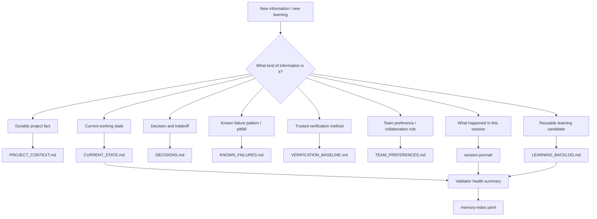
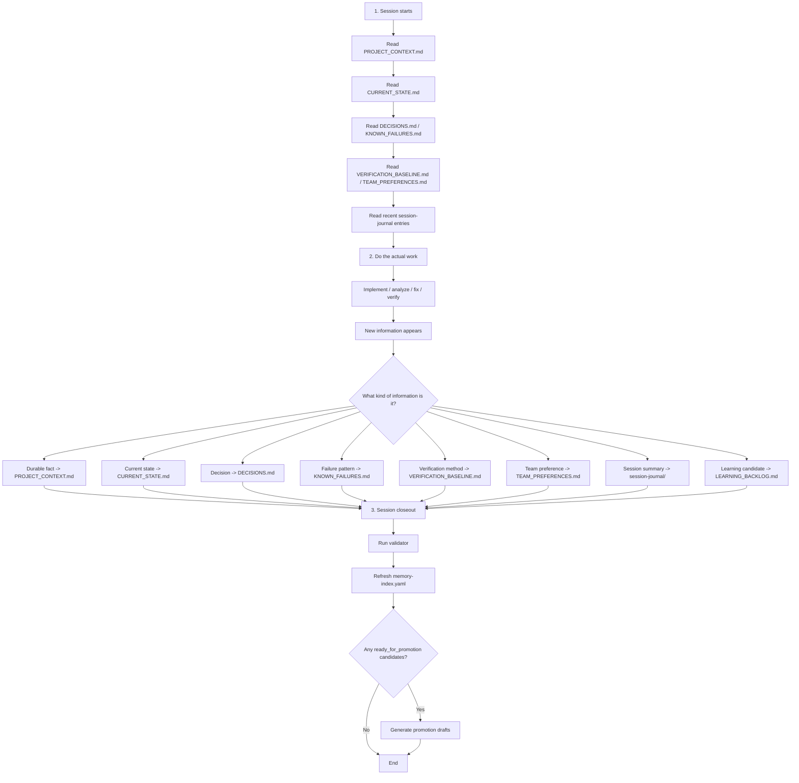
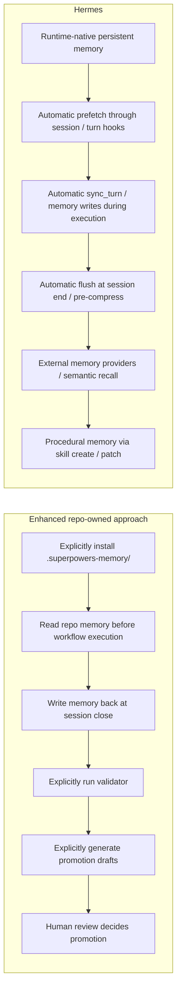

# Memory and Self-Learning Study Notes

This document captures a focused set of discussions about the enhanced memory model, starting from "the responsibility map between memory files." It is intended as learning material for the skill library.

It covers three themes:

1. The responsibility map between memory files
2. The usual read, update, and validation flow in a real development session
3. A comparison between the enhanced repo-owned approach and Hermes runtime memory / self-learning

---

## 1. Responsibility Map Between Memory Files

This section answers one core question:

**When a new piece of information appears, which memory file should it go into?**



### `PROJECT_CONTEXT.md`

Use this for durable facts that are likely to remain true across sessions.

Examples:

- the core goal of the project
- major architecture boundaries
- long-lived module responsibilities
- durable technical constraints

Do not use it for:

- what is being worked on today
- temporary blockers
- one-off debugging notes

Rule of thumb:  
**If the information is still likely to matter in a new session next week, it probably belongs here.**

### `CURRENT_STATE.md`

Use this for the live working state.

Examples:

- the task currently in progress
- current blockers
- what was just finished
- what should happen next

Do not use it for:

- durable architecture rules
- historical pitfall catalogs
- team-wide long-term preferences

Rule of thumb:  
**If it answers "what is going on right now?", it likely belongs here.**

### `DECISIONS.md`

Use this for important decisions and why they were made.

Examples:

- why option A was chosen over option B
- why validation became a required gate
- why a capability belongs in one layer instead of another
- why a learning item should stay in backlog before becoming a skill

Do not use it for:

- plain status updates
- generic session summaries
- facts with no decision rationale

Rule of thumb:  
**If it answers "why did we choose this?", it likely belongs here.**

### `KNOWN_FAILURES.md`

Use this for repeatable pitfalls, failure modes, and fragile spots.

Examples:

- a script fails under Windows PowerShell 5.1
- a naming pattern causes validator noise
- a missing runtime blocks real Linux/macOS verification
- a closeout step is easy to forget

Do not use it for:

- one-off accidents with no reuse value
- issues that have not yet shown a repeatable pattern

Rule of thumb:  
**If the lesson is "do not step on this again," it likely belongs here.**

### `VERIFICATION_BASELINE.md`

Use this for trusted verification rules and evidence standards.

Examples:

- which command is the official validation entrypoint
- what counts as a pass
- what only counts as static review
- how verification differs across Windows, Linux, and macOS

Do not use it for:

- generic project background
- current work state
- collaboration preferences

Rule of thumb:  
**If it answers "how do we prove this is actually true?", it belongs here.**

### `TEAM_PREFERENCES.md`

Use this for team habits, collaboration rules, and durable guardrails.

Examples:

- do not auto-enable superpowers by default
- require explicit workflow invocation
- require human review before promotion
- keep Chinese and English docs aligned when relevant

Rule of thumb:  
**If it sounds like "this is how we usually work as a team," it belongs here.**

### `session-journal/`

Use this for the narrative of what happened in one session.

Examples:

- what changed
- what was fixed
- what verification was run
- what the outcome was

Rule of thumb:  
**If it answers "what happened this time?", write it as a journal entry.**

### `LEARNING_BACKLOG.md`

Use this for reusable learning candidates that are not yet promoted.

Examples:

- a checklist pattern that keeps recurring
- a compatibility lesson that may deserve a rule
- an implementation pattern that may deserve a skill draft

Rule of thumb:  
**If the question is "should this become a reusable artifact later?", it belongs here.**

### `memory-index.yaml`

This is usually maintained by scripts rather than by hand.

It summarizes:

- memory health
- review freshness
- warning and error counts
- backlog candidate counts

Rule of thumb:  
**This is a state index, not a primary knowledge document.**

---

## 2. Typical Read, Update, and Validation Flow in a Real Session

This section shows how the files usually move through a real development session.



### What usually gets read first

The common order is:

1. `PROJECT_CONTEXT.md`
2. `CURRENT_STATE.md`
3. `DECISIONS.md`
4. `KNOWN_FAILURES.md`
5. `VERIFICATION_BASELINE.md`
6. `TEAM_PREFERENCES.md`
7. recent `session-journal/`

Why this order works:

- durable context first
- live context second
- decisions and pitfalls next
- verification and team constraints next
- recent execution narrative last

### What usually gets written near the end

A practical write-back order is:

```text
CURRENT_STATE.md
-> session-journal/
-> DECISIONS.md / KNOWN_FAILURES.md / VERIFICATION_BASELINE.md / TEAM_PREFERENCES.md
-> PROJECT_CONTEXT.md (only when durable facts changed)
-> LEARNING_BACKLOG.md
```

Why:

- current state is the fastest way to preserve handoff status
- journal preserves session history
- durable files require classification judgment
- backlog usually comes after reflection

### Why the validator matters

After writing memory, the common failures are not just "nothing was written."
They are:

- writing the right fact into the wrong file
- missing metadata
- stale current state
- stale journal
- promotion candidates missing key fields

That is why these exist:

- [validate-superpowers-memory.ps1](/D:/spring_AI/superpowers-openspec-team-skills/scripts/validate-superpowers-memory.ps1)
- [validate-superpowers-memory.sh](/D:/spring_AI/superpowers-openspec-team-skills/scripts/validate-superpowers-memory.sh)

The validator is effectively memory QA at session close.

### When promotion drafts happen

Not every session reaches this step.

Promotion only makes sense when `LEARNING_BACKLOG.md` contains entries such as:

- `status: ready_for_promotion`

Then the user or workflow can explicitly run:

- [generate-superpowers-promotion-drafts.ps1](/D:/spring_AI/superpowers-openspec-team-skills/scripts/generate-superpowers-promotion-drafts.ps1)
- [generate-superpowers-promotion-drafts.sh](/D:/spring_AI/superpowers-openspec-team-skills/scripts/generate-superpowers-promotion-drafts.sh)

---

## 3. Comparison With Hermes Runtime Memory / Self-Learning

This section compares the enhanced repo-owned approach with Hermes.



### High-level difference

The enhanced approach is best described as:

- repo-owned memory
- workflow-driven reflection
- human-reviewed promotion

Hermes is best described as:

- runtime-native memory
- hook-driven recall and synchronization
- provider-backed memory
- procedural self-learning

### Where the enhanced approach is stronger

- high auditability
- high Git traceability
- strong human control
- clear file-level semantics
- good fit for multi-person project memory

### Where Hermes is stronger

- automatic recall
- turn-level and session-level synchronization
- session search and semantic retrieval
- provider-backed extensibility
- direct skill evolution through procedural memory

### Practical interpretation

The enhanced approach moves toward Hermes in these areas:

- richer memory surfaces
- structured learning candidates
- validation and health summaries
- promotion draft generation

But it does **not** yet reach Hermes in:

- runtime hooks
- automatic turn sync
- external memory providers
- true procedural memory
- automatic skill creation / patching

### Summary Table

| Dimension | Enhanced repo-owned approach | Hermes |
| --- | --- | --- |
| Memory location | `.superpowers-memory/` in repo | runtime memory + files + providers |
| Activation | explicit install and explicit workflow use | part of runtime lifecycle |
| Read path | fixed files | hooks + prefetch + semantic recall |
| Write path | end-of-session write-back | continuous runtime sync |
| Governance | validator + memory-index | runtime orchestration |
| Learning output | backlog candidates | memory + procedural memory |
| Promotion | draft first, then human review | create/edit/patch skills directly |
| External memory | none | provider abstraction |
| Auditability | very high | medium-high, more runtime-oriented |
| Automation | low to medium | high |

### Final summary

The enhanced design makes **project-level explicit memory and human-controlled learning closure** much stronger. Hermes goes further by adding **runtime memory orchestration, semantic recall, and procedural skill evolution**.
